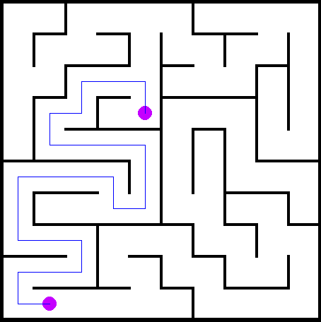
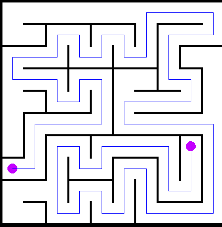

# Гениратор лабиринтов

Данный проект позволит вам создать лабиринт определенного размера **Width** на **Height** клеток, после чего можно будет контактировать с лабиринтом различными способами.

## Задачи проекта
- генерировать лабиринт
- строить кратчайший путь между двумя точками
- сохранять изображение лабиринта
- сохранять сжатый лабиринт и восстанавливать изображение по сжатому формату

## ⚙️Инструкция по использованию:
### Генерация лабиринта🖼️
Кнопка **Start game** отвечает за генерацию лабиринта, но для его генерации нужно сначала ввести в поля `Width` и `Height` значения
высоты и ширины лабиринта. После нажатия кнопки вас перебросит на новую страницу, на которой будет рандомно сгенерирован сам лабиринт.

На картинках показаны лабиринты размером 10х10, который могут быть сгенерированы, используя мой алгоритм.

Для того чтобы сгенерировать лабиринт заново, нажмите `R`, чтобы выйти в меню нажмите `P`.

### Генерация маршрута🏁
Чтобы сгенерировать маршрут между двумя точками, надо нажать сначала на одну клетку лабиринта, потом на другую, после чего будет
сгенерирован маршрут между ними.

Для удаления маршрута достаточно нажать `Esc`, после чего, можно будет вернуться к выбору клеток для построения маршрута.

Примеры построенного маршрута

### Скачивание лабиринта📄
Лабиринт скачивается в виде файла

| **Название** | **Кол-во байтов** |                                                                                           **Коментарии** |
|--------------|:-----------------:|---------------------------------------------------------------------------------------------------------:|
| Сигнатура    |         4         |                               Сигнатура обозначает **kiva**, если перевести из шестнадцатеричной системы |
| Ширина       |         1         |                                          данный байт кодирует ширину лабиринта(максимальное значение 31) |
| Высота       |         1         |                                          данный байт кодирует высоту лабиринта(максимальное значение 31) |
| Сам лабиринт |    от 1 до 32     | Каждая строка лабиринта преобразовывается в двоичный и после переводится в шестнадцатеричную систему |

### Отзывы♻️

>Генерация лабиринта происходит действительно быстро и легко, что позволяет пользователям быстро получить интересный и разнообразный лабиринт для решения.
Реализация алгоритма поиска кратчайшего пути в лабиринте работает хорошо и точно, что позволяет пользователям получать быстрые и точные результаты при поиске пути через лабиринт. 
Интерфейс пользователя является простым и интуитивно понятным, что позволяет пользователям быстро понимать, как использовать программу для создания и решения лабиринтов.
Код проекта является чистым и хорошо структурированным, что позволяет разработчикам легко понимать, как работает программа, и вносить необходимые изменения в код в будущем.