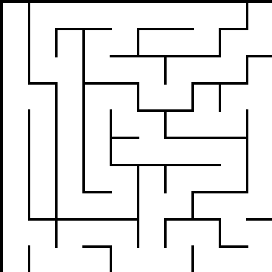
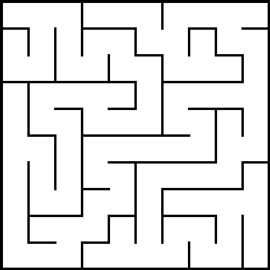

Гениратор лабиринтов

Данный проект позволит вам создать лабиринт определенного размера **Width** на **Height** клеток, после чего можно будет контактировать с лабиринтом различными способами.

## Задачи проекта
- генерировать лабиринт
- строить кратчайший путь между двумя точками
- сохранять изображение лабиринта
- сохранять сжатый лабиринт и восстанавливать изображение по сжатому формату

## ⚙️Инструкция по использованию:
### Генерация лабиринта🖼️
Кнопка **Start game** отвечает за генерацию лабиринта, но для его генерации нужно сначала ввести в поля `Width` и `Height` значения
высоты и ширины лабиринта. После нажатия кнопки вас перебросит на новую страницу, на которой будет рандомно сгенерирован сам лабиринт.

На картинках показаны лабиринты размером 10х10, который могут быть сгенерированы, используя мой алгоритм.

### Скачивание лабиринта📄
Лабиринт скачивается в виде файла

| **Название** | **Кол-во байтов** |                                                                                           **Коментарии** |
|--------------|:-----------------:|---------------------------------------------------------------------------------------------------------:|
| Сигнатура    |         4         |                               Сигнатура обозначает **kiva**, если перевести из шестнадцатеричной системы |
| Ширина       |         1         |                                          данный байт кодирует ширину лабиринта(максимальное значение 31) |
| Высота       |         1         |                                          данный байт кодирует высоту лабиринта(максимальное значение 31) |
| Сам лабиринт |    от 1 до 32     | Каждая строка лабиринта преобразовывается в двоичный и после переводится в шестнадцатеричную систему |

